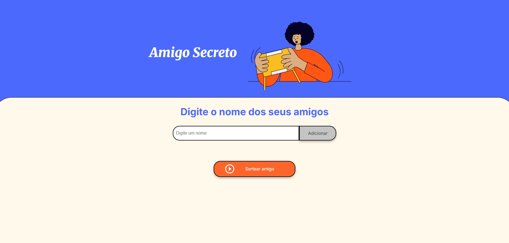

# Challenge do Amigo Secreto



## 💡 Sobre o Projeto

Este projeto permite que você adicione nomes de amigos e realize um sorteio para descobrir quem será o amigo secreto. O objetivo principal é praticar lógica de programação e manipulação de DOM com JavaScript.

## 🚀 Como usar

1. Clone este repositório:
   ```sh
   git clone https://github.com/seu-usuario/challenge-amigo-secreto.git
   ```
2. Abra o arquivo `index.html` em seu navegador.

## 🖥️ Funcionalidades

- Adicionar nomes de amigos à lista.
- Visualizar a lista de amigos adicionados.
- Sortear aleatoriamente um amigo secreto.

## 📁 Estrutura de Pastas

```
.
├── app.js
├── index.html
├── style.css
├── assets/
│   ├── amigo-secreto.png
│   └── play_circle_outline.png
├── img/
│   └── AmigoSecreto.jpg
└── README.md
```

### 🟢 Challenge do Amigo Secreto: Explore Funções e Listas  
  

- Funções, listas e arrays  
- Iterações e loops (`for`, `while`)  
- Manipulação de coleções em JavaScript  
